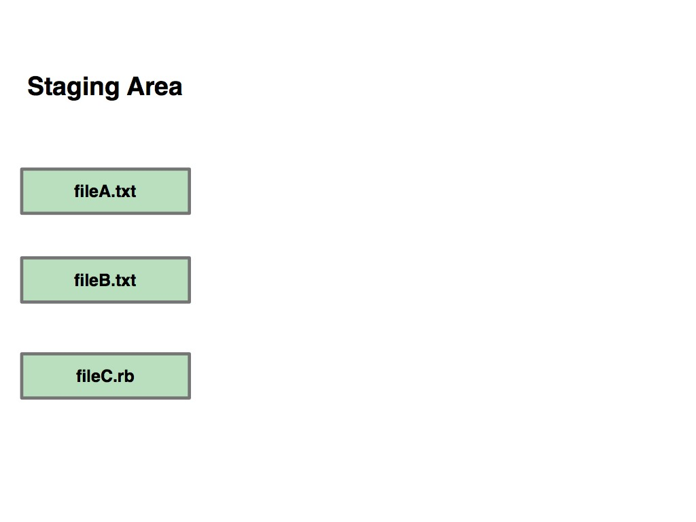
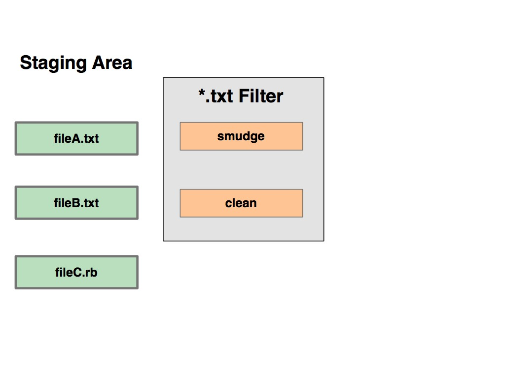
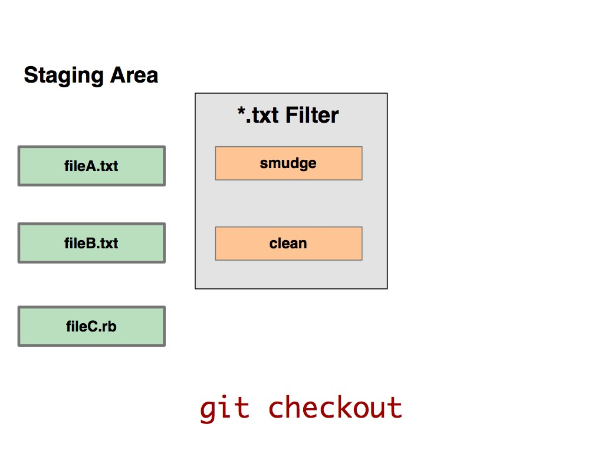
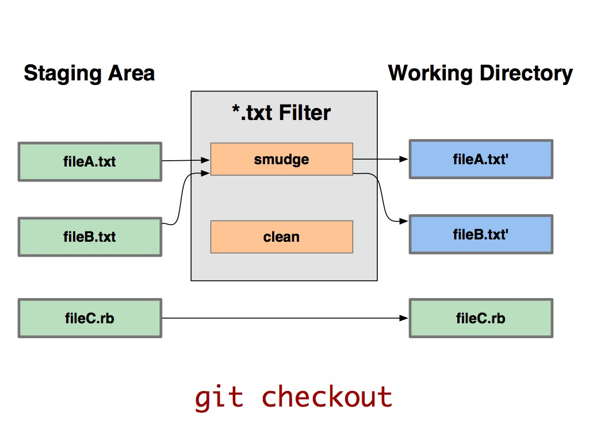
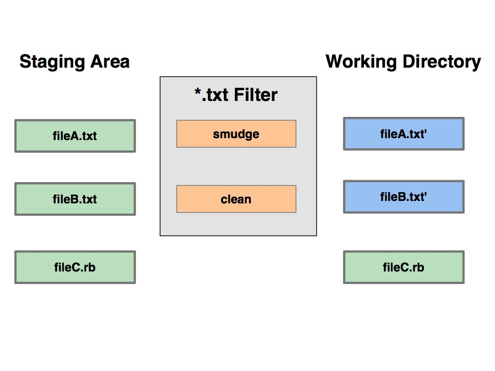
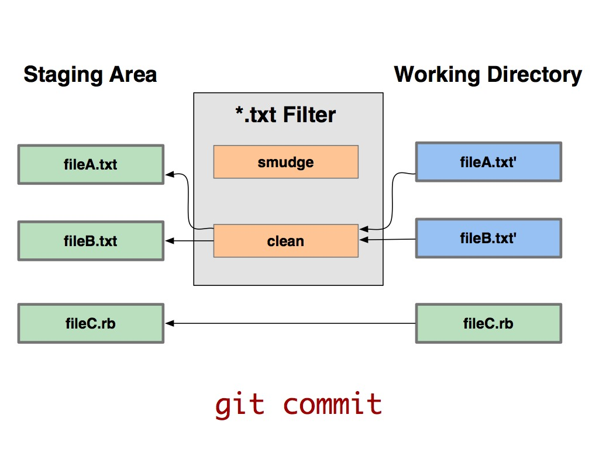

!SLIDE 

# Filtering #

!SLIDE center

!SLIDE center

!SLIDE center

!SLIDE center

!SLIDE center

!SLIDE center

!SLIDE center

!SLIDE

# expanding a $Date$ #

!SLIDE

# /usr/bin/expand_date

@@@ruby
	#! /usr/bin/env ruby
	data = STDIN.read
	date = `git log --pretty=format:"%ad" -1`
	puts data.gsub('$Date$', 
			'$Date: ' + date + '$')
@@@

!SLIDE commandline incremental

	$ git config filter.dater.smudge expand_date

	$ git config filter.dater.clean \
	  'perl -pe "s/\\\$Date[^\\\$]*\\\$/\\\$Date\\\$/"'
	
!SLIDE 

# test it #

!SLIDE commandline incremental

	$ echo '# $Date$' > date_test.rb
	$ echo 'date*.rb filter=dater' >> .gitattributes
	$ git add date_test.rb .gitattributes
	$ git commit -m "Testing date expansion in Git"
	$ rm date_test.rb
	$ git checkout date_test.rb

	$ cat date_test.rb	
	# $Date: Tue Apr 21 07:26:52 2009 -0700$