!SLIDE bullets incremental code

* git log origin/master..
* git log origin/master..master
* git log master ^origin/master

!SLIDE center

!SLIDE center
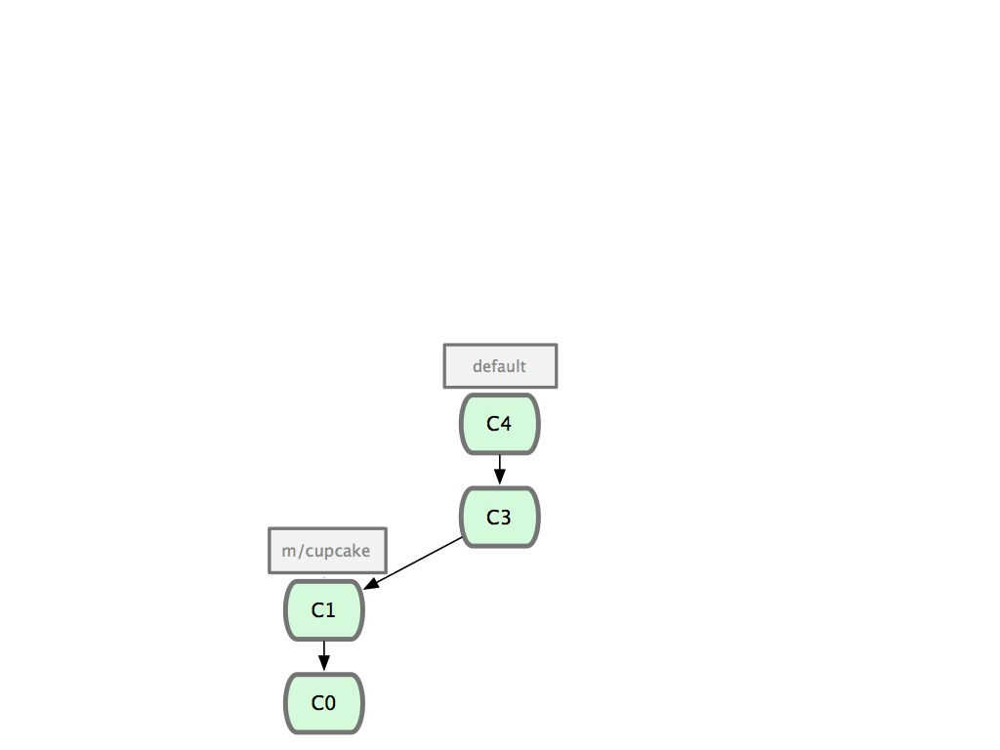

!SLIDE center
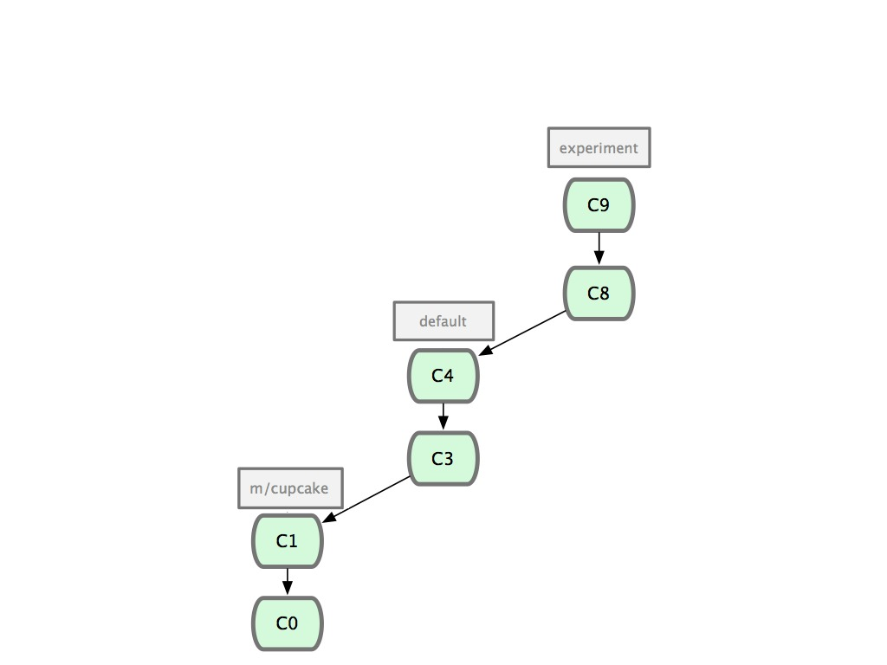

!SLIDE center
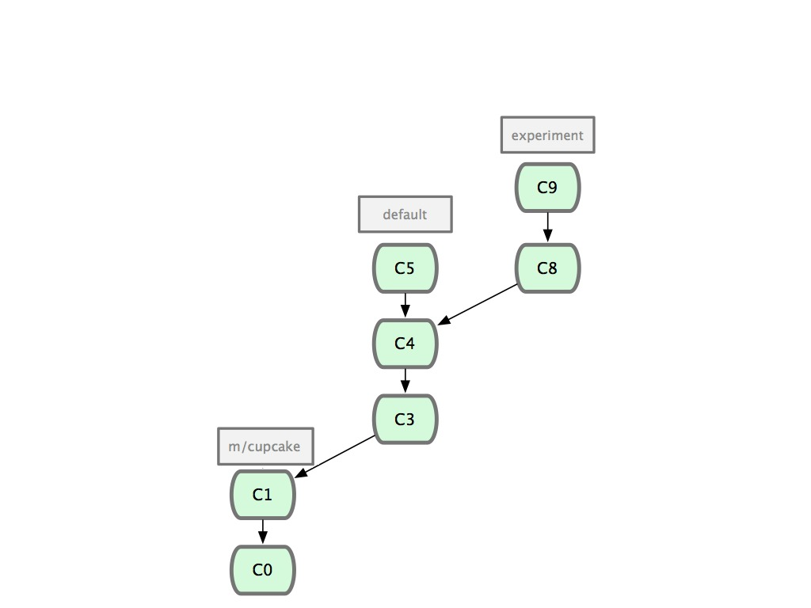

!SLIDE center
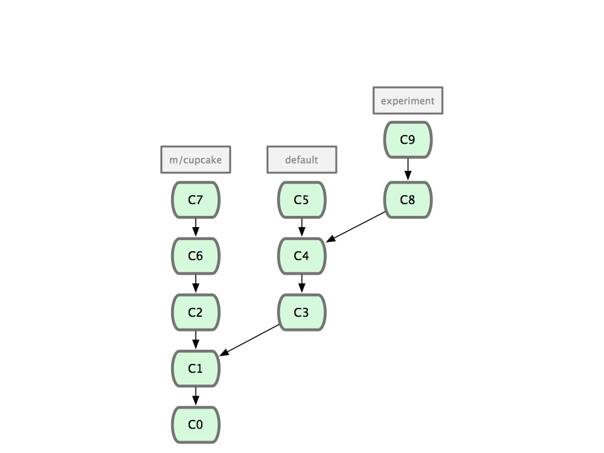

!SLIDE center

!SLIDE center
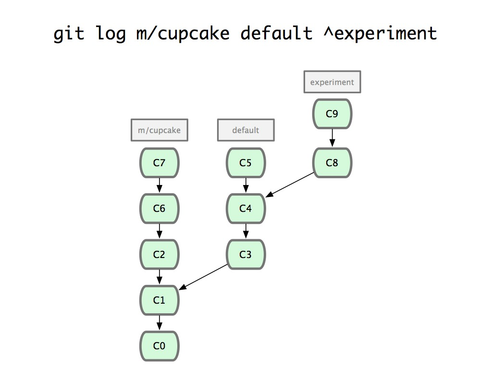

!SLIDE center
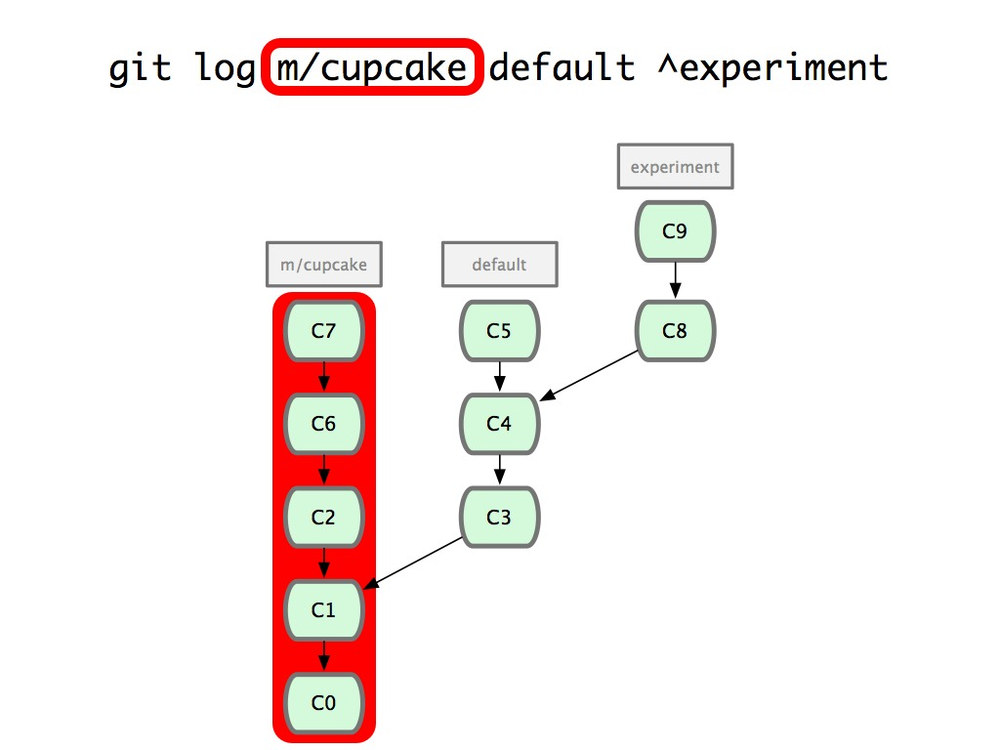

!SLIDE center
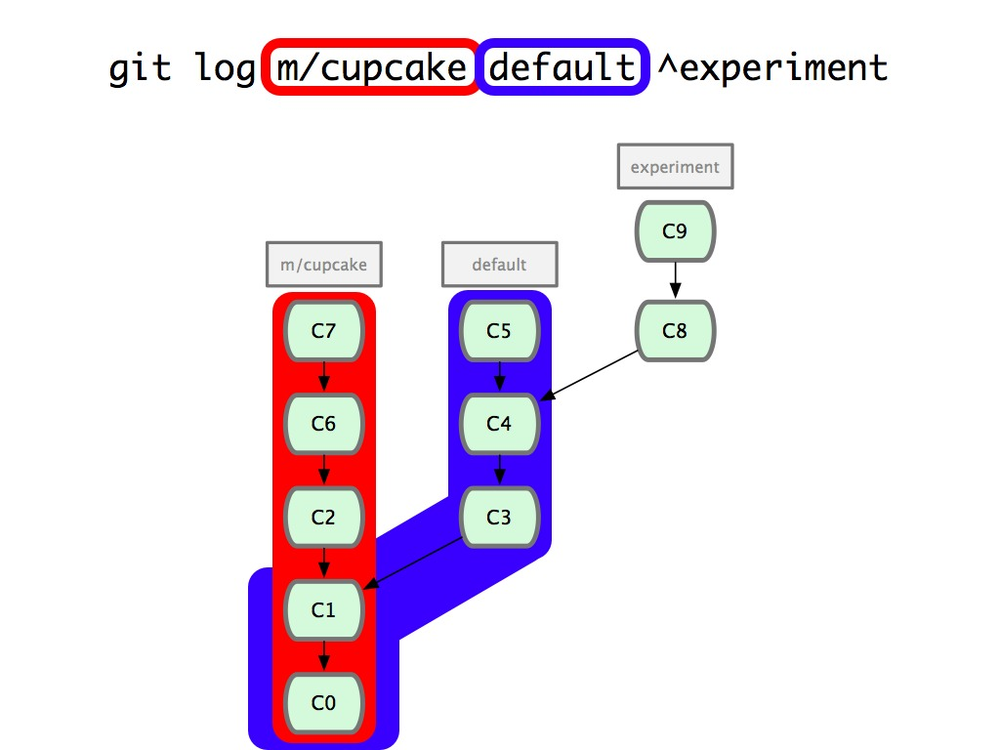

!SLIDE center
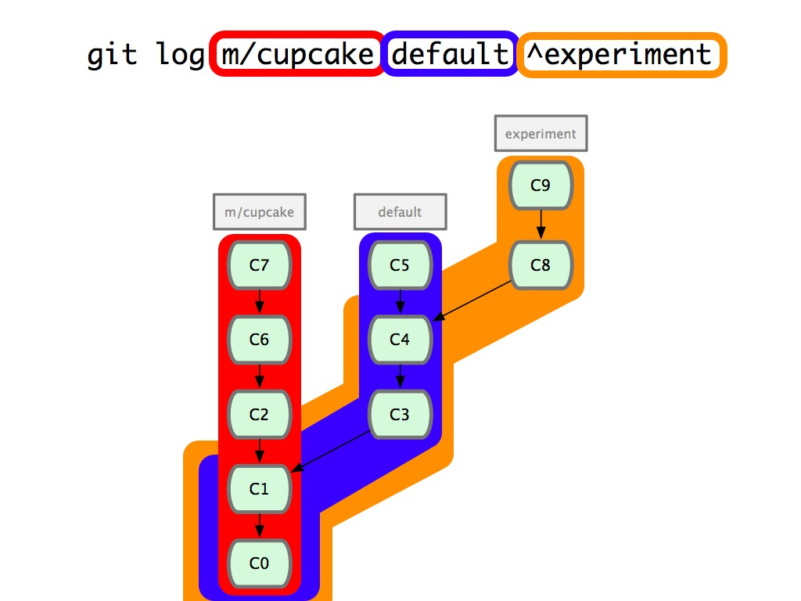

!SLIDE center
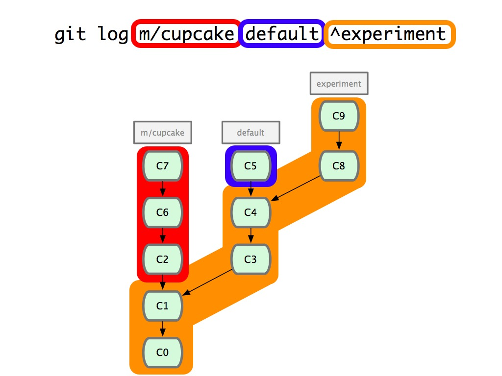

!SLIDE center
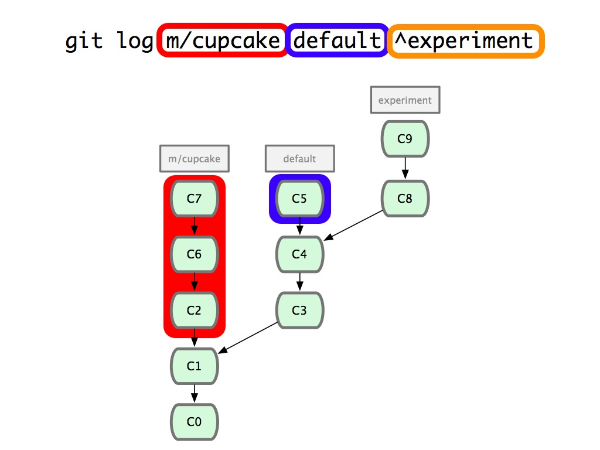

!SLIDE center
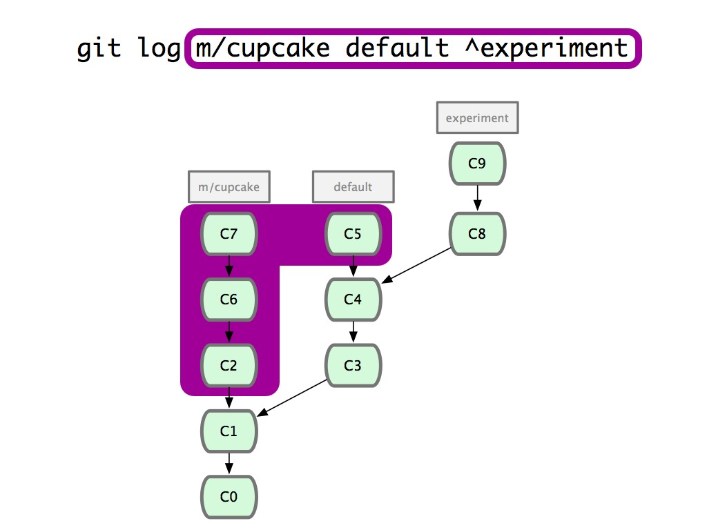

